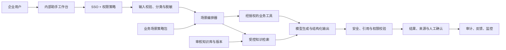

# 企业内部智能体通用改造手册 Implementation Plan

> **For agentic workers:** REQUIRED SUB-SKILL: Use superpowers:subagent-driven-development (recommended) or superpowers:executing-plans to implement this plan task-by-task. Steps use checkbox (`- [ ]`) syntax for tracking.

**Goal:** 用同一套可审计、安全、可评测的生产底座，将现有智能体快速改造成不同部门的企业内部知识与流程助手。

**Architecture:** 基础平台固定为身份权限、机构/部门隔离、受控知识库、模型编排、审计、监控和灰度发布。每次切换业务只替换场景卡、数据契约、知识源、风险规则、工具白名单、提示词和评测集；不直接复用上一业务的规则或答案。

**Tech Stack:** FastAPI、Pydantic、OIDC/JWT、PostgreSQL、对象存储、向量检索、Redis、OpenTelemetry、pytest、CI/CD。

---

## 1. 如何使用本手册

每启动一个新业务场景，先完成“场景卡”，再按第 2 节确定风险级别；随后复制第 8 节的实施阶段清单。任何一项未填写清楚，不进入开发。

```
新业务需求
  → 场景卡（用户、任务、数据、输出、成功标准）
  → 风险分级（只读 / 建议 / 审批后执行）
  → 知识与权限设计
  → 离线评测
  → 影子运行
  → 小范围试点
  → 扩大使用
```

默认首发形态是“知识与流程助手”：回答制度、项目、产品和流程问题；可检索、可总结、可起草，但不能修改业务数据、发送外部消息或绕过审批。只有完成风险评估后才升级为分析助手或执行助手。

## 2. 场景卡：换业务时先填写的内容

为每个场景创建 `docs/business-scenarios/<scenario-key>/scenario-card.md`，必须填写以下内容。

| 项目 | 必填内容 | 示例：研发知识助手 |
|---|---|---|
| 业务目标 | 要减少的时间、错误或等待 | 减少寻找技术规范的时间 |
| 目标用户 | 部门、角色、人数、权限边界 | 后端工程师、测试工程师 |
| 用户任务 | 一个场景只选 1–3 个高频任务 | 查询规范、定位系统负责人、生成变更检查单 |
| 输入 | 允许来源、敏感级别、最大长度 | 已授权 Git 文档、内部 Wiki、工单摘要 |
| 输出 | 格式、必须引用、禁止内容 | 带链接和版本的摘要；不生成生产变更 |
| 工具 | 只读/写入/外部通信清单 | Wiki 搜索只读；工单创建需审批 |
| 数据边界 | 组织、部门、项目、地域限制 | 仅当前组织和当前项目空间 |
| 风险 | 错答、泄密、越权、错误执行后果 | 暴露密钥、引用已废弃规范 |
| 人工责任人 | 业务负责人、内容负责人、技术负责人 | 研发效能负责人、架构委员会 |
| 成功指标 | 质量、采用率、效率和安全阈值 | 引用正确率、任务完成率、越权为零 |

场景卡的退出标准是：业务负责人确认它描述的是一个具体工作流，而不是“做一个万能助手”；安全负责人确认数据和操作边界；内容负责人确认首批知识来源。

## 3. 哪些内容可复用，哪些必须替换

| 层 | 固定复用 | 每换一个业务必须重做 |
|---|---|---|
| 身份与权限 | SSO、JWT 验证、RBAC/ABAC、审计 | 角色、部门/项目范围、数据所有者、管理员权限 |
| 数据存储 | 加密、备份、删除、保留、隔离 | 数据分类、字段、保留期限、地域、脱敏规则 |
| 知识库 | 审核、版本、发布、回滚、引用 | 内容来源、更新频率、审核人、有效期、检索标签 |
| 模型编排 | 超时、限流、成本预算、结构化输出 | 系统提示词、任务 schema、工具白名单、拒答策略 |
| 风险控制 | 高风险确认、幂等、回滚、告警 | 风险规则、审批人、操作阈值、错误处置路径 |
| 评测 | 离线集、影子运行、灰度、事故复盘 | 真实任务集、正确答案、业务 KPI、失败样本 |
| 前端体验 | 会话、来源展示、反馈、审计入口 | 表单字段、结果布局、审批动作、角色菜单 |

不得复用的内容包括上一场景的系统提示词、业务规则、知识库、评测答案、审批权限和风险阈值；它们会把旧业务假设带入新场景。

## 4. 通用生产架构



### 固定组件职责

- **SSO 与权限策略**：每个请求解析用户、组织、部门、项目和角色；数据查询、知识检索和工具调用均强制带权限过滤。
- **输入校验、分类与脱敏**：限制长度/附件类型；识别密钥、个人信息、财务、代码和合同等敏感级别，并按策略拒绝、掩码或仅在受控环境处理。
- **场景编排器**：根据场景卡调用指定提示词、知识库、工具白名单和输出 schema；禁止“默认调用所有工具”。
- **受控知识检索**：仅搜索已发布、未过期、用户有权阅读的内容，返回文档版本和定位。
- **业务工具网关**：对外部系统采用最小权限 token、显式参数校验、超时、审计、幂等键和审批令牌。
- **安全校验器**：阻止无引用事实、跨权限数据、敏感信息回显、超出场景的建议和未经批准的写操作。
- **审计与监控**：记录请求摘要、权限决策、检索来源、工具动作、输出版本、反馈、耗时、错误和成本；不将原始敏感内容写入普通日志。

## 5. 通用数据模型与数据契约

所有业务共享以下最小实体；可按场景增列字段，但不得删除隔离、版本和审计字段。

| 实体 | 最小字段 | 用途 |
|---|---|---|
| `Actor` | `user_id`、`organization_id`、`roles`、`scopes` | 权限决策主体 |
| `Workspace` | `organization_id`、`department_id`、`project_id`、`retention_policy` | 数据和知识的隔离边界 |
| `Conversation` | `workspace_id`、`actor_id`、`scenario_key`、`status` | 会话上下文；不跨工作区复用 |
| `KnowledgeDocument` | `workspace_id`、`source_uri`、`classification`、`owner`、`review_status`、`expires_at` | 原始内容和治理状态 |
| `KnowledgeRelease` | `release_id`、`workspace_id`、`approved_by`、`published_at` | 可检索的不可变知识版本 |
| `ToolInvocation` | `actor_id`、`workspace_id`、`tool_name`、`operation`、`idempotency_key`、`approval_id` | 工具动作审计与重试控制 |
| `OutputArtifact` | `scenario_key`、`schema_version`、`evidence_ids`、`model_version`、`prompt_version` | 可追溯输出 |
| `Feedback` | `artifact_id`、`rating`、`correction`、`reviewer` | 人工质量信号，不自动训练 |
| `AuditEvent` | `request_id`、`actor_id`、`workspace_id`、`event_type`、`occurred_at` | 安全与合规复盘 |

每个新场景还需定义输入/输出 JSON Schema。示例：采购制度助手的输出含 `answer`、`citations[]`、`policy_version`、`confidence_reason`、`requires_human_review`；禁止只返回一段不可追溯文本。

## 6. 知识库与工具治理模板

### 知识库准入

- 每份资料必须指定内容所有者、业务范围、密级、来源链接、发布日期、复审日期、可访问工作区和审核状态。
- 内容状态只能是 `draft`、`in_review`、`approved`、`published`、`superseded`、`revoked`；只有 `published` 且未过期内容参与检索。
- 更改制度、价格、合同、产品规格、流程或安全规范时，先发布新版本，再将旧版标为 `superseded`；不可静默覆盖。
- 回答中的事实性主张必须引用至少一个已发布来源；无来源时输出“未在当前获授权知识库中找到依据”。

### 工具分级

| 工具级别 | 示例 | 允许条件 |
|---|---|---|
| L0 只读 | 搜索 Wiki、读取已授权工单、查看报表 | 用户权限通过、输出脱敏 |
| L1 生成草稿 | 生成邮件、工单内容、会议纪要 | 仅生成草稿，用户在系统外确认发送 |
| L2 创建待审批对象 | 创建工单、发起采购申请、生成报表任务 | 业务规则校验、显示影响、指定审批人 |
| L3 修改业务数据 | 更新 CRM、变更库存、调整配置 | 双重确认、最小权限、幂等键、完整审计和可回滚 |
| L4 外部通信/不可逆动作 | 发送客户消息、付款、删除数据、生产发布 | 默认关闭；需独立风险评估、审批链、模拟环境和紧急停用开关 |

首发场景只能包含 L0 和 L1。L2–L4 不是“加个按钮”即可上线，必须重做风险评估、审批策略、失败恢复和专项测试。

## 7. 风险分级与系统行为

| 级别 | 典型情况 | 系统必须行为 |
|---|---|---|
| R0 低风险 | 已授权知识的摘要、检索、格式转换 | 返回来源、版本和不确定性说明 |
| R1 中风险 | 业务解释、制度建议、草稿生成 | 显示依据；对数据不足和冲突内容降级；由用户确认后使用 |
| R2 高风险 | 涉及财务、合同、人事、客户承诺、敏感数据 | 限定角色；强制引用；进入人工复核或审批，不执行写操作 |
| R3 极高风险 | 对外发送、资金、删除、生产变更、法律/合规决定 | 默认拒绝或仅生成方案；需专门批准的动作工作流、幂等/回滚和实时告警 |

任何出现权限不足、知识过期、证据冲突、输入不完整、敏感信息未授权或工具响应异常时，统一行为是停止动作、说明原因、提供安全的人工处理路径并记录审计事件。

## 8. 每个新场景的阶段化实施清单

### 阶段 A：发现与冻结（1–2 周）

- [ ] 创建场景卡、数据流图和 R0–R3 风险登记册。
- [ ] 选择一个部门、1–3 个高频任务和一名业务内容负责人；拒绝“全公司通用聊天”作为首发范围。
- [ ] 建立至少 30 个真实但脱敏的代表性任务，包含正确、模糊、越权、过期和恶意输入样本。
- [ ] 明确量化目标，例如引用正确率、任务完成时间、拒绝越权率和人工改写率。
- [ ] 退出条件：业务、安全和内容负责人共同批准场景卡。

### 阶段 B：安全与知识准备（1–3 周）

- [ ] 接入 SSO，配置角色、工作区和项目级权限；编写跨工作区访问失败测试。
- [ ] 完成首批知识清单、内容审核、密级标记和发布版本；编写“未发布/过期内容不可检索”测试。
- [ ] 配置输入限制、敏感数据检测、速率限制、成本预算、审计日志、备份和健康检查。
- [ ] 退出条件：越权、泄密、过期来源和日志泄密测试通过。

### 阶段 C：只读 MVP（2–4 周）

- [ ] 仅实现 L0 检索、问答、摘要和带来源输出；为每项业务输出定义 Pydantic schema。
- [ ] 对每项事实性输出执行“来源存在、用户可访问、来源未过期”的校验。
- [ ] 建立反馈按钮：有用、无用、来源错误、权限问题、需更新知识；反馈进入待处理队列。
- [ ] 退出条件：离线任务集达到场景卡冻结的正确性/引用指标，且无跨权限访问。

### 阶段 D：影子运行与小范围试点（2–6 周）

- [ ] 先让少量目标用户在非关键任务中使用，不连接写入工具。
- [ ] 每周复盘无引用输出、错误引用、敏感数据回显、拒答失败、延迟、成本和用户反馈。
- [ ] 用新的失败样本补充评测集，重新运行全量回归；禁止只测修复的单个案例。
- [ ] 退出条件：连续两个评审周期符合阈值，业务负责人批准扩大用户范围。

### 阶段 E：受控动作扩展（按需，3–8 周/每类动作）

- [ ] 为每个 L2–L4 动作单独建立动作卡：影响对象、权限、参数 schema、审批人、超时、幂等键、回滚和告警。
- [ ] 先在沙箱或模拟系统验证；对失败重试、重复提交、审批过期和工具超时写专项测试。
- [ ] 上线时默认要求预览和明确确认；L3/L4 保留一键紧急停用。
- [ ] 退出条件：专项安全评审和业务所有者签字完成。

## 9. 评测、监控和停止条件

### 最小离线评测集

每个场景至少包含：普通问题、需要引用的问题、知识过期问题、知识冲突问题、无权限问题、敏感信息问题、提示词注入、工具超时和超范围请求。每条样本标注预期行为，而不只标注“正确答案”。

### 线上指标

- 质量：引用正确率、无依据输出率、用户反馈、人工改写率、任务完成率。
- 安全：跨权限读取数、敏感数据回显数、越权工具调用数、拒答正确率。
- 运行：p95 延迟、错误率、知识库新鲜度、工具失败率、每任务成本。
- 采用：活跃用户、重复使用率、节省时间的用户反馈；采用率不能替代安全指标。

### 必须暂停的情况

1. 发生任何确认的跨工作区数据泄露或未授权写操作；
2. 对高风险业务内容持续输出无来源或过期来源；
3. 关键工具出现不可恢复的重复执行、无法回滚或审批绕过；
4. 监控、审计或紧急停用开关不可用；
5. 新知识发布导致核心评测集明显退化。

暂停后按“关闭开关→保护证据→影响评估→根因分析→修复→全量回归→负责人重新批准”的顺序恢复。

## 10. 常见业务替换示例

| 新业务 | 替换输入与知识 | 输出边界 | 首发工具级别 | 核心评测 |
|---|---|---|---|---|
| 人力资源制度助手 | 员工手册、福利、培训、流程；严格隔离个人档案 | 解释制度、生成沟通草稿；不做绩效/解雇决定 | L0–L1 | 版本正确、敏感人事信息不泄露、歧义升级人工 |
| 研发知识助手 | 架构文档、API 规范、运行手册、工单 | 引用规范、生成检查单；不直接改生产配置 | L0–L1 | 引用最新版本、秘密脱敏、危险命令拒绝 |
| 销售支持助手 | 产品资料、价格规则、销售流程、授权 CRM 摘要 | 生成方案与跟进草稿；不作价格承诺 | L0–L1 | 价格/条款时效、客户隔离、外发前确认 |
| 采购流程助手 | 制度、目录、供应商准入、合同模板 | 解释流程、生成申请草稿；不下单/签约 | L0–L1 | 规则引用、金额阈值提醒、审批链完整 |
| 数据分析助手 | 已授权数据集、指标字典、报表定义 | 生成受控查询和解释；不直接导出敏感明细 | L0–L2 | 指标口径、行列权限、查询成本和数据泄露 |

## 11. 从医疗计划迁移时的替换映射

| 医疗计划概念 | 企业内部助手对应概念 | 更换时的动作 |
|---|---|---|
| 临床适应范围 | 场景卡与部门任务边界 | 重写用户、任务、禁用场景和成功指标 |
| 红旗规则 | 高风险业务规则 | 重新定义数据泄露、合同、财务、人事、生产变更等阻断条件 |
| 医学知识库 | 审核后的企业知识库 | 替换来源、内容所有者、有效期和审批流程 |
| 医生最终决策 | 业务责任人最终确认 | 明确谁对草稿、审批和执行动作负责 |
| 临床验证集 | 真实脱敏业务任务集 | 重做正确答案、失败行为和验收阈值 |
| 影子运行 | 非关键任务试用 | 保持不写入、不外发、可复盘 |
| 临床试点 | 部门小范围试点 | 按部门/项目/角色开关逐步扩大 |

## 12. 交付物清单

每个已上线场景必须能够提供以下文件：场景卡、数据流图、风险登记册、权限矩阵、知识源清单与发布记录、提示词与输出 schema 版本、工具动作卡、离线评测报告、试点周报、事故记录、上线批准和回滚记录。

这套清单让项目即使更换团队、模型、行业或业务负责人，仍可以从证据和流程上复现“为什么能上线、谁批准、用了什么知识、出了问题如何停止”。
