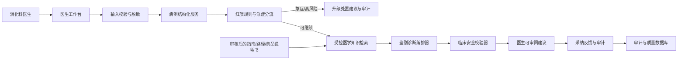

# 消化科鉴别诊断辅助智能体设计

## 1. 目标与范围

本项目将现有通用聊天机器人改造为面向消化科医生的受控临床辅助系统。首期仅服务单机构的消化科成人门诊，聚焦腹痛、消化不良和反酸的鉴别诊断辅助。

系统向医生提供红旗征象识别、必须优先排除的疾病、分层鉴别诊断候选、建议补充的病史/体格检查/检查项目，以及每项建议的可追溯医学依据。医生保留全部临床决策权。

首期明确不包含：自动诊断、自动开药、自动开检查、自动写入病历、面向患者的诊疗问答、儿童/孕产妇/术后患者处理、急危重症的诊断建议和直接连接 HIS/EMR/LIS。

## 2. 临床工作流

1. 医生创建匿名病例，并手工填写或粘贴病史、症状、体征、既往史、用药、过敏史和现有检查结果。
2. 系统从自由文本中提取候选结构化字段；医生审核和修改后，确认字段成为正式推理输入。
3. 独立红旗规则引擎执行分流。
4. P0/P1 风险病例优先显示升级处置建议；P0 不生成常规鉴别诊断。
5. 对可继续评估的病例，系统检索经审核、在有效期内的医学知识库。
6. 编排器生成“必须排除 / 常见可能 / 需补充信息后判断”三层候选，附支持与反对证据、缺失信息、来源和版本。
7. 临床安全校验器验证适用人群、来源、风险等级和建议边界。
8. 医生查看、采纳、部分采纳或不采纳结果；系统记录原因和完整审计信息。

## 3. 系统架构

组件职责：

- 医生工作台：以结构化表单为主、粘贴文本为辅；关键字段缺失时禁止生成高风险建议。
- 病例结构化服务：只建议字段，不替医生确认；医生确认的内容是唯一正式输入。
- 红旗规则引擎：独立于 LLM，优先识别呕血/黑便、休克征象、急腹症、进行性吞咽困难、显著体重下降、持续呕吐、贫血、黄疸等风险。
- 受控医学知识检索：只检索审批后、版本化内容，不将通用网页搜索结果用作临床证据。
- 鉴别诊断编排器：形成候选和待补充信息，不输出唯一诊断或处方。
- 临床安全校验器：拦截无来源、来源过期、超人群、与红旗矛盾或不确定性过高的输出。
- 审计与质量平台：保存输入摘要、规则命中、检索证据、模型/提示词/知识库版本、医生操作和最终临床印象。

首期采用单机构、单知识库、单模型版本和单消化科专家组审核；多机构和 HIS 集成均为后续独立项目。

## 4. 数据模型

| 实体 | 核心字段 | 约束 |
|---|---|---|
| Case | 匿名病例号、机构、成人标记、创建医生、状态、创建时间 | 不保存直接身份标识 |
| ClinicalFeature | 症状、时长、部位/性质、严重度、伴随症状、生命体征、既往史、用药、过敏史、检查结果、缺失项 | 区分模型提取和医生确认 |
| RedFlagAssessment | 规则版本、命中项、风险等级、推荐处置、确认医生 | 不可由模型覆盖 |
| DifferentialSuggestion | 疾病候选、层级、支持/反对证据、待补充信息、引用条目、生成版本 | 每个临床主张必须引用证据 |
| EvidenceSource | 来源类型、发布机构、版本、发布日期、适用范围、有效期、原文定位、审核状态 | 仅已审核且未过期内容可用 |
| ClinicianFeedback | 采纳状态、修改内容、不采纳原因、最终临床印象 | 不自动进入训练集 |
| AuditEvent | 操作人、角色、时间、病例、前后版本、模型/规则/知识库版本、请求 ID | 仅授权角色可访问 |

如未来必须关联真实患者，身份映射表必须独立加密保存、最小授权访问，且不得随常规模型请求外发。

## 5. 知识库规范

### 准入与审核

- 可准入：国家/专业学会指南、院内批准诊疗路径、药品说明书、系统性综述。
- 禁止直接纳入：未审核网页、论坛、患者自述、来源不清的内容。
- 每份内容包含发布机构、疾病范围、适用人群、发布日期、失效/复审日期、证据等级、审核人和审批记录。
- 医学编辑负责结构化切分；至少一名消化科专家审核。高风险红旗和处置内容必须双人复核。

### 版本与更新

- 旧指南保留历史版本并标记失效，不允许无痕删除。
- 每个病例绑定其使用的知识库发布版本。
- 高风险内容每月巡检，其他内容至少每半年复审；安全通报触发紧急下架和影响病例追溯。
- 检索限制为成人门诊、腹痛、消化不良和反酸相关段落，并返回原文定位。

## 6. 风险分级与行为

| 级别 | 例子 | 系统行为 |
|---|---|---|
| P0 危急 | 消化道大出血、休克征象、急腹症高度可疑、意识异常 | 停止常规鉴别输出，显示紧急处置/转诊提醒，记录高优先级审计事件 |
| P1 高风险 | 进行性吞咽困难、消瘦、贫血、持续呕吐、黄疸、肿瘤高风险线索 | 显示警示、优先排除项和证据；医生确认后才显示检查方向 |
| P2 一般临床辅助 | 无红旗的腹痛、反酸、消化不良 | 输出三层鉴别、补问项和检查方向，并附证据 |
| P3 非诊疗辅助 | 指南查询、病历结构化、患者宣教草稿 | 可自动生成，但必须保留来源和版本 |

当关键字段缺失、知识库无可靠证据、来源过期、证据冲突或病例超出范围时，系统必须降级为“信息不足，请按常规流程评估”，不得猜测或输出确定性临床结论。

## 7. 接口边界

首期只开放医生工作台 API：

| 接口 | 用途 | 关键约束 |
|---|---|---|
| POST /cases | 新建匿名病例 | 验证成人门诊范围，不接收直接身份标识 |
| PUT /cases/{id}/features | 保存医生确认的结构化资料 | 字段校验、版本号、并发保护 |
| POST /cases/{id}/extract | 从粘贴病史中提取候选字段 | 结果必须由医生确认 |
| POST /cases/{id}/triage | 执行红旗分层 | 规则版本固定，模型不可覆盖 |
| POST /cases/{id}/differential | 生成鉴别辅助 | 仅在分诊允许且关键字段完整时运行 |
| GET /cases/{id}/evidence | 查看证据 | 返回原文定位、版本、审核状态和适用人群 |
| POST /cases/{id}/feedback | 保存医生反馈 | 不直接用于训练 |
| GET /cases/{id}/audit | 读取审计轨迹 | 仅所属医生、科室管理员和合规角色可访问 |
| POST /knowledge/documents | 提交知识内容 | 仅知识管理员，进入审核队列 |
| POST /knowledge/releases | 发布知识版本 | 医学审核人和管理员双确认 |

所有接口使用机构级 SSO/OIDC、RBAC/ABAC、TLS、请求 ID、审计日志、速率限制和机构级数据隔离。

## 8. 分阶段交付

### 阶段 0：临床与合规立项（2–4 周）

- 建立消化科负责人、急诊/护理代表、医学信息、信息安全、法务/合规和产品负责人组成的治理组。
- 冻结适应范围、红旗清单、禁用场景、升级处置路径和失效降级策略。
- 确定试点机构、数据保留期限、医生使用告知、审计责任和评测方案。

**验收产物：** 适应范围说明、风险管理文件、知识准入标准、试点评测方案。

### 阶段 1：安全底座（3–5 周）

- 实现认证、角色权限、机构/病例/知识库隔离。
- 将 SQLite/全局 FAISS 替换为生产数据库、对象存储和隔离向量检索。
- 移除 eval，增加上传/请求/会话/模型成本限制。
- 建立审计、密钥管理、备份恢复、健康检查、监控和告警。

**验收产物：** 可部署、安全但尚不提供鉴别诊断的医生工作台。

### 阶段 2：病例结构化与红旗分流（3–4 周）

- 建立腹痛、消化不良和反酸的结构化表单。
- 实现可审核的文本字段提取。
- 实现并由专家审核 P0/P1 红旗规则、升级提醒和边界病例测试。

**验收产物：** 可补全信息、识别高风险并安全升级处置的工作流。

### 阶段 3：证据受控的鉴别诊断（4–6 周）

- 建立首批审核知识库。
- 实现三层鉴别候选、证据引用、适用条件和知识版本展示。
- 实现来源、适用人群、冲突和信息缺失的安全校验与拒答。

**验收产物：** 医生可用、可解释、可追溯的鉴别诊断辅助。

### 阶段 4：离线验证与影子运行（4–8 周）

- 建立脱敏回顾性病例集，覆盖高风险、少见病、共病和信息不全场景。
- 由独立消化科医生盲评红旗召回、候选覆盖、引用正确性、错误建议和工作负担。
- 影子运行且不影响实际决策；逐例复盘 P0/P1 病例。

**验收产物：** 临床验证报告、改进清单、冻结的模型与知识库版本。

### 阶段 5：受控试点（8–12 周）

- 在一家机构内仅向经培训的少量消化科医生开放。
- 周度复盘；高风险错误触发停用、修复、回归测试和重新发布。
- 监控采纳率、改写率、红旗漏检、无证据输出、可用性和响应时延。

**验收产物：** 试点评估报告和扩大范围的决策材料。

腹泻、肝功能异常和消化道出血均作为后续独立模块处理，每个模块必须重新进行风险评估、知识审核和临床验证。

## 9. 上线阈值

- P0 红旗病例零漏检；P1 的目标召回阈值由临床治理组预先设定。
- 100% 临床建议具有有效、可访问的证据来源和版本。
- 100% 高风险输出保存规则、知识、模型、提示词和医生操作审计轨迹。
- 对无依据、超范围、关键字段缺失的病例，拒答/降级测试必须通过。
- 权限、跨机构数据隔离、恶意上传、提示词注入、服务中断、备份恢复测试全部通过。
- 常规病例建议的目标响应时间不超过 10 秒；不可用时可回退至常规临床流程。
- 完成医生培训、试点告知、事件上报和停用流程演练。

## 10. 设计原则

规则负责安全边界；审核知识库负责证据；模型负责归纳与组织；医生负责最终临床决策。
